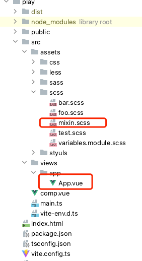

<p align="center">
  
</p>
<h1 align="center">
unplugin-vue-cssvars
</h1>
<p align="center">
🌀 A vue plugin that allows you to use vue3's CSSVars feature in css files
</p>
<p align="center">
English | <a href="https://github.com/baiwusanyu-c/unplugin-vue-cssvars/blob/master/README.ZH-CN.md" target="_blank">中文</a>
</p>

## Feature

* 🧩 It is a function extension of vue
* 🌈 Compatible with multiple bundled platforms（vite、webpack）
* ⛰ Support css, sass, scss, less, stylus
*  ⚡ Support hmr

## Core Strategy

1.When using the development server,
`unplugin-vue-cssvars` will analyze the referenced css file from the component,
and inject styles in the transformation code of `@vitejs/plugin-vue`
2.When building, `unplugin-vue-cssvars` will analyze the referenced css file from the component and inject it into
sfc, don't worry about generating redundant code, packaging tools (such as vite) will automatically handle it.

## Install

```bash
npm i unplugin-vue-cssvars -D
```
Or
```bash
yarn add unplugin-vue-cssvars -D
```
Or
```bash
pnpm add unplugin-vue-cssvars -D
```

## Usage
1. use plugin and set options
<details>
<summary>Vite</summary>

```ts
// vite.config.ts
import { defineConfig } from 'vite'
import { viteVueCSSVars } from 'unplugin-vue-cssvars'
import vue from '@vitejs/plugin-vue'
import type { PluginOption } from 'vite'
export default defineConfig({
  plugins: [
    vue(),
    viteVueCSSVars({
      include: [/.vue/],
      includeCompile: ['**/**.scss'],
      server: false,
    }) as PluginOption,
  ],
})
```

</details>
<br>
<details>
<summary>Rollup</summary>

```ts
// rollup.config.js
import { rollupVueCSSVars } from 'unplugin-vue-cssvars'
export default {
  plugins: [
    rollupVueCSSVars(/* options */),
  ],
}
```

</details>
<br>
<details>
<summary>Webpack</summary>

```ts
// webpack.config.js
module.exports = {
  /* ... */
  plugins: [
    require('unplugin-vue-cssvars').webpackVueCSSVars({ /* options */ }),
  ],
}
```
</details>
<br>
<details>
<summary>Vue CLI</summary>

```ts
// vue.config.js
module.exports = {
  configureWebpack: {
    plugins: [
      require('unplugin-vue-cssvars').webpackVueCSSVars({ /* options */ }),
    ],
  },
}
```

</details>
<br>
<details>
<summary>ESBuild</summary>

```ts
// esbuild.config.js
import { build } from 'esbuild'
import { esbuildVueCSSVars } from 'unplugin-vue-cssvars'

build({
  plugins: [esbuildVueCSSVars(/* options */)],
})
```
</details>

2. use `v-bind-m`

```
// foo.css
.foo{
   color: v-bind-m(fontColor)
}
```

3. use alias   
For example you have the following project structure：  



 ```
// App.vue
<template>
  <div class="scss">
    app
  </div>
</template>

<style lang="scss" scoped>
@import '@/assets/scss/mixin';
</style>

```

Then you can configure like this

```
// vite.config.ts
import { resolve } from 'path'
import { defineConfig } from 'vite'
import vue from '@vitejs/plugin-vue'
import { viteVueCSSVars } from '../dist'
export default defineConfig({
  resolve: {
    alias: {
      '@': resolve(__dirname, './src'),
    },
  },
  plugins: [
    vue(),
    viteVueCSSVars({
      include: [/.vue/],
      includeCompile: ['**/**.scss'],
      alias: {
        '@': resolve(__dirname, './src'),
      },
    }),
  ],
})

````

## Option

```typescript
export interface Options {
   /**
    * Provide path which will be transformed
    * @default process.cwd()
    */
   rootDir?: string
   
   /**
    * RegExp or glob to match files to be transformed
    */
   include?: FilterPattern

   /**
    * RegExp or glob to match files to NOT be transformed
    */
   exclude?: FilterPattern
   
   /**
    * Specify the file to be compiled, for example,
    * if you want to compile scss, then you can pass in ['** /**.sass']
    * @property { ['** /**.css', '** /**.less', '** /**.scss', '** /**.sass', '** /**.styl'] }
    * @default ['** /**.css']
    */
   includeCompile?: Array<string>
   
   /**
    * Flag whether to start with server at development time,
    * because unplugin-vue-cssvars uses different strategies for building and server development
    * If it is not passed in vite, unplugin-vue-cssvars will automatically 
    * recognize the command of config to determine the server value
    * @default true
    */
   server?: boolean

   /**
    * alias
    * @default undefined
    */
   alias?: Record<string, string>
}
```

## Tips

### ● Rules When Transforming Analysis
1. In `sfc`, if `@import` specifies a suffix, the conversion analysis will be performed according to the suffix file, 
otherwise the conversion analysis will be performed according to the `lang` attribute of the current `style` tag (default `css`)
2. Rules in `css`: `css` files can only reference `css` files, and only files with `css` suffixes will be parsed.
3. Rules in `scss`, `less`, `stylus`: `scss`, `less`, `stylus` files can refer to `css` files, and corresponding `scss` or `less` files or `stylus` files,
   Prioritize conversion analysis of files with preprocessor suffixes, if the file does not exist, analyze its `css` file

### ● Variable extraction rules in SFC
1. For `script setup`, `unplugin-vue-cssvars` will extract all variables to match.
````
<script setup>
    const color = 'red'
</script>
````
2. For `composition api`, `unplugin-vue-cssvars` will extract `setup` function return variables for matching.
````
<script>
 import { defineComponent } from 'vue'
 export default defineComponent( {
   setup(){
       const color = 'red'
       return {
          color
       }
   }
})
</script>
````
3. For `options api`, `unplugin-vue-cssvars` will extract `data` function return variables for matching.
````
<script>
 export default {
   data(){
       const color = 'red'
       return {
          color
       }
   }
}
</script>
````
4. For normal `script`, `unplugin-vue-cssvars` will extract all variables to match.
````
<script>
    const color = 'red'
</script>
````

### ● Variable conflict rules in SFC
1. In sfc, there are options API and composition API, and all variables will be merged. If there are conflicts in variables, 
the syntax that appears later will take precedence
(for example, if options API is written first and composition API is written later, composition API takes precedence).
2. There are `script setup`, `options api` and `composition api` in `sfc`, all variables will be merged, 
if there is a variable conflict, `script setup` will take precedence
3. Ordinary `script` in `sfc` will not exist at the same time as `options api` and `composition api`
4. If the normal `script` exists in `sfc`, there must be `script setup`
5. Common `script` and `script setup` variables in `sfc` will be merged, 
if there is a variable conflict, `script setup` will take precedence

### ● Priority after style injection
1. Starting from `sfc`, analyze the `css` files referenced in the `style` tag, and in accordance with the order of references in the `css` files, they will be promoted in depth-first order and injected into `sfc`.
2. After being injected into `sfc`, its priority is completely determined by the compiler of `@vue/compiler-dom`.

## Thanks
* [vue](https://github.com/vuejs/core)
* [vite](https://github.com/vitejs/vite)
* [unplugin](https://github.com/unjs/unplugin)
